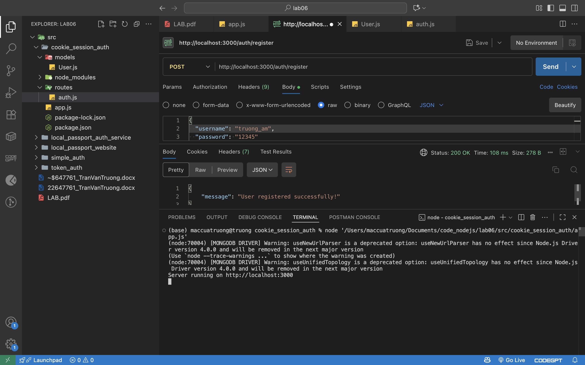
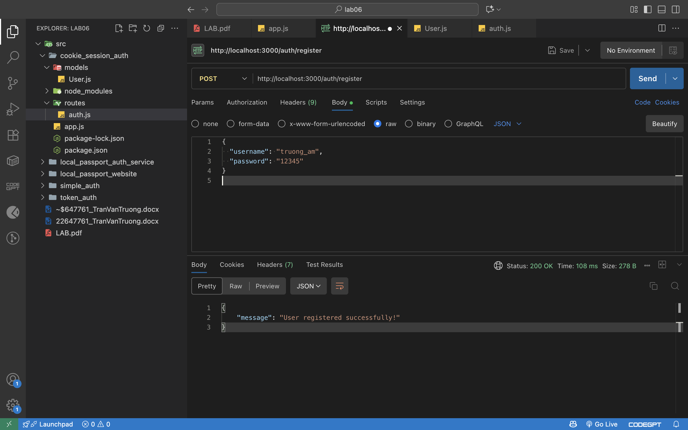
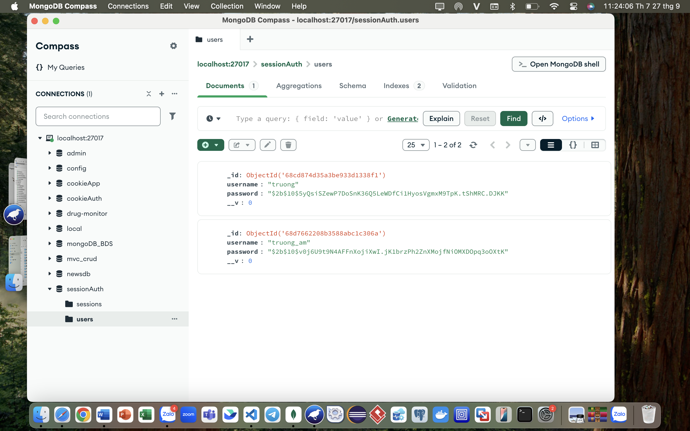
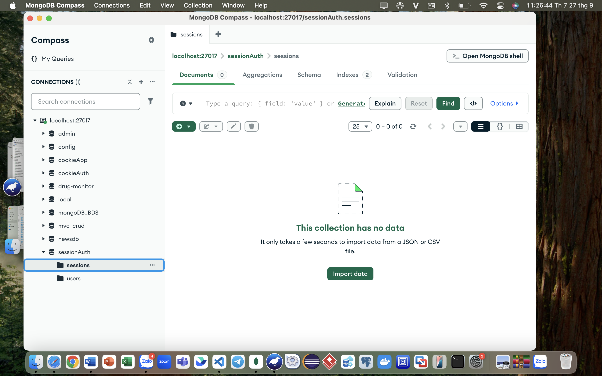
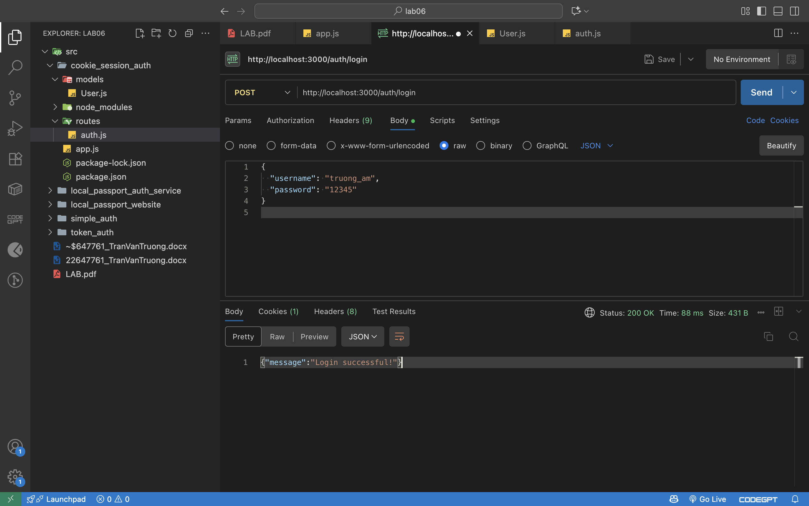
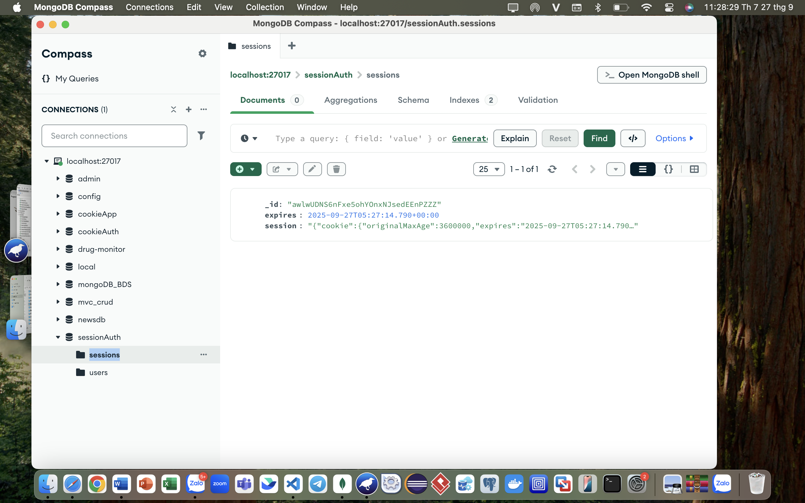
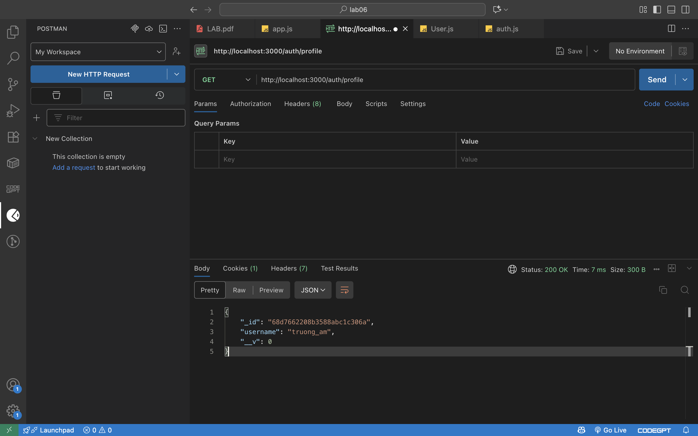
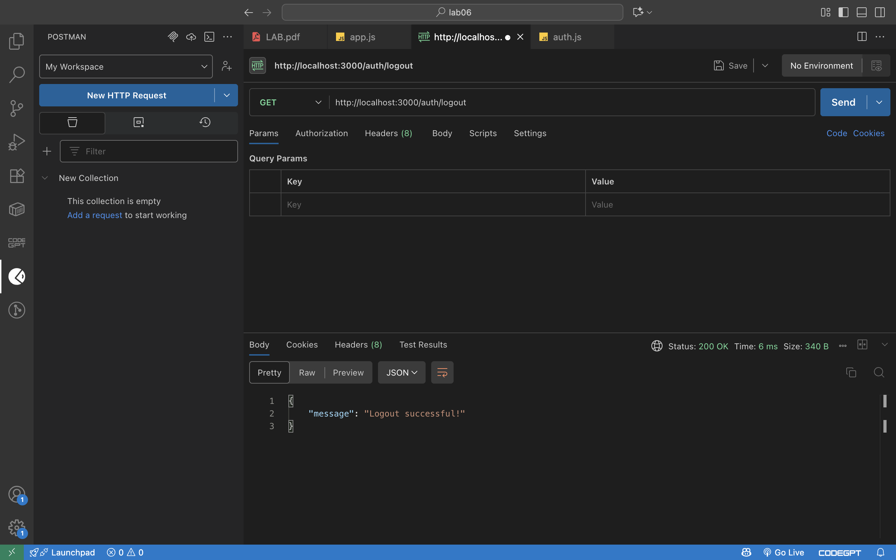
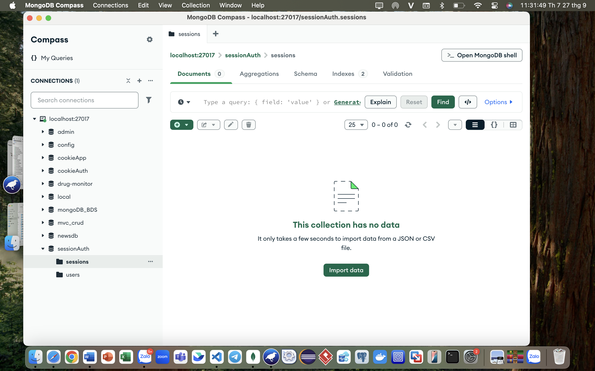

Create five repositories then commiting all source code

Write read me on each repository to show the way you use to test POSTMAN

Using source code provided by lecturer. Read source code and test all
APIs with POSTMAN.

2.  cookie_session_auth source code

    a.  node cookie_auth.js

{width="7.25in" height="4.53125in"}

b.  register

{width="7.25in" height="4.53125in"}

Check in database

{width="7.25in" height="4.53125in"}

{width="7.25in" height="4.53125in"}

c.  login

{width="7.25in" height="4.53125in"}

Check in database

{width="7.25in" height="4.53125in"}

d.  go to profile

{width="7.25in" height="4.53125in"}

e.  go to logout and check cookie is deleted in database

{width="7.25in" height="4.53125in"}

{width="7.25in" height="4.53125in"}

